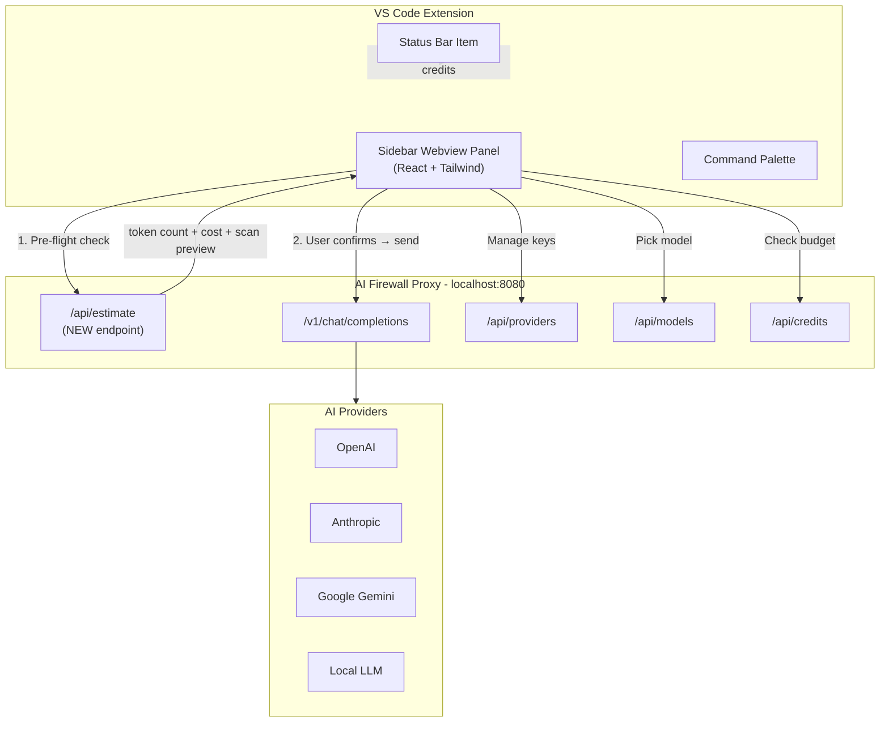
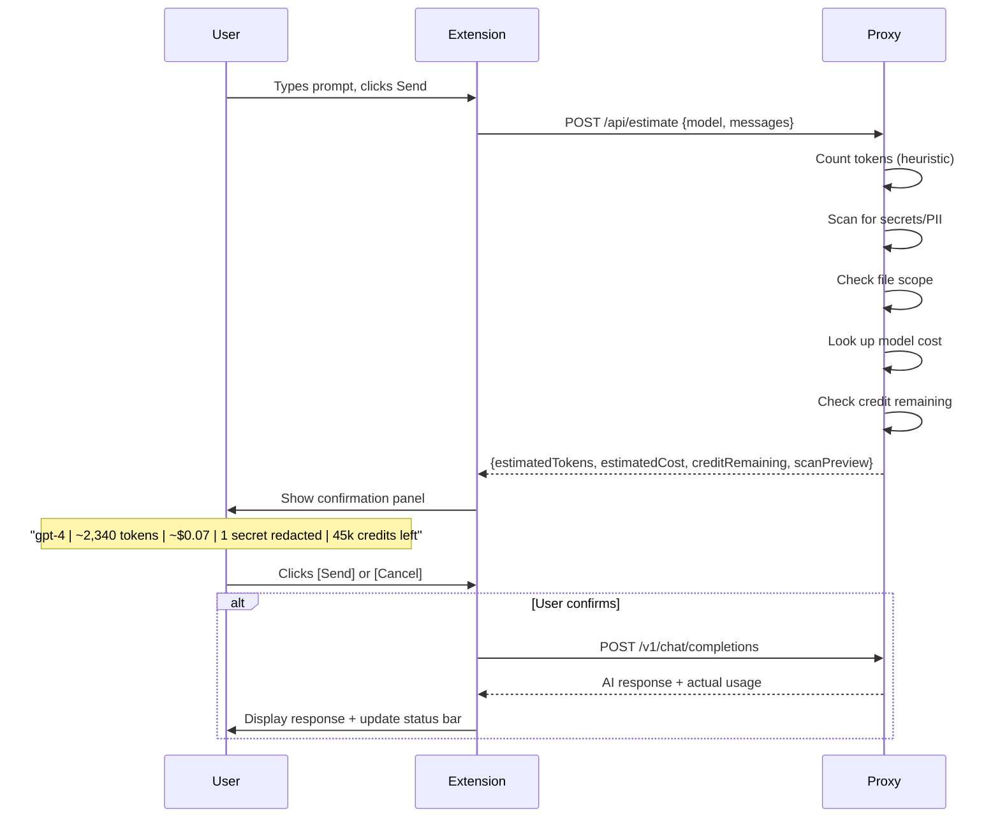

# AI Firewall VS Code Extension + Pre-flight Cost Estimation

## What We're Building

A VS Code extension that IS the AI interface for developers. Users add their own API keys, pick models, see pre-flight cost/credit estimates before every prompt, and chat with AI — all traffic routed through our firewall proxy. No Copilot/Cursor needed alongside.

## Architecture




## Pre-flight Cost Estimation Flow

This is the core differentiator — no AI tool does this today.




## Component Breakdown

### Part 1: New Backend Endpoint (proxy)

Add `POST /api/estimate` to [proxy/src/routes/estimate.route.ts](ai-firewall/proxy/src/routes/estimate.route.ts) (new file):

- Accepts same schema as `/v1/chat/completions` (model + messages + metadata)
- Runs the full scan pipeline (secrets, PII, file scope, policy) **without forwarding**
- Estimates token count using a simple heuristic: `Math.ceil(text.length / 4)` (accurate enough for estimation; actual usage is tracked from provider response)
- Looks up model cost from `modelService.findModelByName()`
- Checks credit via `creditService.checkCredit()`
- Returns:

```typescript
{
  estimatedInputTokens: number;
  estimatedCost: number;
  creditRemaining: number;
  creditLimitType: string;
  scan: {
    action: "ALLOW" | "BLOCK" | "REDACT";
    secretsFound: number;
    piiFound: number;
    filesBlocked: string[];
    riskScore: number;
    reasons: string[];
  };
  model: { name: string; provider: string; };
}
```

Wire into [proxy/src/server.ts](ai-firewall/proxy/src/server.ts). Also add CORS support to the proxy (extension webview needs it) via `@fastify/cors`.

### Part 2: VS Code Extension Structure

New directory: `ai-firewall/extension/`

```
extension/
  package.json          (VS Code extension manifest + activation events + commands)
  tsconfig.json
  src/
    extension.ts        (activate/deactivate, register providers + commands)
    statusBar.ts        (status bar item: green/yellow/red + cost + credits)
    commands.ts         (command palette: open chat, add provider, show scope)
    services/
      proxyClient.ts    (HTTP client wrapping all proxy API calls)
      tokenEstimator.ts (local token estimation for instant preview)
    views/
      chatViewProvider.ts  (WebviewViewProvider for the sidebar panel)
      webview/
        index.html      (shell HTML for the React webview)
        main.tsx        (React entry point)
        App.tsx         (main app with tab routing)
        components/
          Chat.tsx       (chat interface with message history)
          PreFlight.tsx  (cost estimation confirmation panel)
          Providers.tsx  (add/list/remove providers + API keys)
          Models.tsx     (model picker with cost info)
          Credits.tsx    (credit status with progress bars)
          StatusBadge.tsx (inline scan result badges)
        styles.css      (Tailwind)
```

### Part 3: Extension Features

**Sidebar Panel (Webview)** — 5 tabs:

- **Chat** — message input, conversation history, model selector dropdown, pre-flight confirmation inline before each send
- **Providers** — add provider (name, API key, base URL), list providers, toggle enabled, delete. Keys are sent to proxy and stored encrypted.
- **Models** — list all models grouped by provider, show cost/1k tokens, toggle enabled
- **Credits** — progress bars per provider/model, remaining/total, reset date
- **Activity** — recent requests: timestamp, model, action, tokens, cost

**Status Bar Item:**

- Persistent indicator at bottom of VS Code
- Shows: `AI Firewall: [icon] gpt-4 | 23.4k tokens used | $1.20`
- Color: green (healthy), yellow (>80% credit used), red (blocked/exhausted)

**Commands (Command Palette):**

- `AI Firewall: Open Chat`
- `AI Firewall: Add Provider`
- `AI Firewall: Select Model`
- `AI Firewall: Show Credit Status`
- `AI Firewall: Show File Scope`

**Context Menu (Right-click on code):**

- `AI Firewall: Explain This Code`
- `AI Firewall: Refactor This Code`
- `AI Firewall: Add Documentation`

These commands take the selected code, wrap it in a prompt, and send through the chat flow (with pre-flight).

### Part 4: Extension package.json Key Config

```json
{
  "name": "ai-firewall",
  "displayName": "AI Firewall",
  "description": "Secure AI Gateway — BYOK, credit control, pre-flight cost estimation",
  "version": "0.1.0",
  "engines": { "vscode": "^1.85.0" },
  "categories": ["Machine Learning", "Other"],
  "activationEvents": ["onStartupFinished"],
  "main": "./dist/extension.js",
  "contributes": {
    "viewsContainers": {
      "activitybar": [{
        "id": "ai-firewall",
        "title": "AI Firewall",
        "icon": "resources/icon.svg"
      }]
    },
    "views": {
      "ai-firewall": [{
        "type": "webview",
        "id": "aiFirewall.chatView",
        "name": "AI Firewall"
      }]
    },
    "commands": [...],
    "menus": {
      "editor/context": [...]
    },
    "configuration": {
      "title": "AI Firewall",
      "properties": {
        "aiFirewall.proxyUrl": { "type": "string", "default": "http://localhost:8080" },
        "aiFirewall.defaultModel": { "type": "string", "default": "gpt-4" },
        "aiFirewall.showPreFlight": { "type": "boolean", "default": true },
        "aiFirewall.autoRedact": { "type": "boolean", "default": true }
      }
    }
  }
}
```

### Part 5: Webview Build Pipeline

The sidebar webview is a small React app bundled with esbuild:

- React + Tailwind CSS for the UI
- `@vscode/webview-ui-toolkit` for native VS Code look-and-feel
- esbuild bundles both the extension host code and the webview code
- Communication between extension host and webview via `vscode.postMessage()` / `window.addEventListener('message')`

### Part 6: Browser Extension (after VS Code extension)

Chrome Manifest V3 extension in `ai-firewall/browser-extension/`:

- Intercepts requests to `api.openai.com`, `api.anthropic.com`, `generativelanguage.googleapis.com`
- Redirects through `localhost:8080` proxy
- Badge icon shows scan status
- Popup shows recent activity summary

This is Phase 2 of UI work, after the VS Code extension is solid.

## Build Order

1. Backend: `/api/estimate` endpoint + CORS support
2. Extension scaffold: package.json, activation, status bar
3. Sidebar webview: React app shell with tab navigation
4. Chat tab: message input/output, model selector, pre-flight flow
5. Providers tab: add/list/manage providers and API keys
6. Models tab: list models, show costs
7. Credits tab: usage bars, status
8. Context menu commands: explain/refactor/document selected code
9. Polish: error handling, connection status, offline indicators

